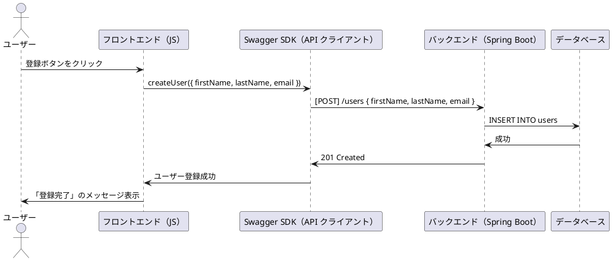

### **✅ Swagger を活用するとシーケンス図の作成も簡単になるのか？**
**結論:**  
**✅ はい、Swagger（OpenAPI）を活用すると、シーケンス図の作成も簡単になります！**  
Swagger によって **「画面イベント → API エンドポイント → パラメータ」** の流れが統一されるため、  
**手作業で整理しなくても、シーケンス図を効率的に生成・管理できるようになる** からです。

---

## **✅ Swagger を活用したシーケンス図作成のメリット**
| **項目** | **従来の手作業でのシーケンス図** | **Swagger 活用時のシーケンス図** |
|----------|------------------------------|------------------------------|
| **API の仕様変更** | 仕様変更のたびに図を手直し | **Swagger 仕様から自動的に更新できる** |
| **画面イベントとの対応付け** | Excel / Word で手動管理 | **Swagger UI で API 呼び出しとイベントを可視化** |
| **パラメータ管理** | API のリクエスト / レスポンスを別管理 | **Swagger 定義がそのままパラメータ情報として利用可能** |
| **ドキュメントとの連携** | シーケンス図と API 仕様が分離 | **Swagger 仕様とシーケンス図を統一** |

**✅ Swagger を活用すると、「画面イベント → API → パラメータ」の流れが整理され、シーケンス図を自動生成することも可能になる！**

---

## **✅ Swagger を活用したシーケンス図の作成手順**
### **📌 ❶ Swagger で API の流れを定義**
Swagger（OpenAPI）で **「API の呼び出しフロー」** を明確に記述する。

#### **📌 Swagger 定義の例**
```yaml
openapi: 3.0.0
info:
  title: ユーザー登録 API
  version: 1.0.0

paths:
  /users:
    post:
      summary: ユーザーを登録
      description: ユーザーがフォームから登録するAPI
      parameters:
        - name: X-Request-ID
          in: header
          schema:
            type: string
      requestBody:
        required: true
        content:
          application/json:
            schema:
              type: object
              properties:
                firstName:
                  type: string
                lastName:
                  type: string
                email:
                  type: string
      responses:
        "201":
          description: ユーザーが登録されました
```
**✅ これにより、API のフローが一貫した形でドキュメント化される！**

---

### **📌 ❷ Swagger の API 仕様からシーケンス図を作成**
Swagger の API 定義をもとに、以下のような **シーケンス図を自動生成する** ことができる。

#### **📌 シーケンス図（PlantUML を使用した例）**

**✅ このシーケンス図は Swagger の情報から自動的に作成できる！**  
（Swagger 定義を PlantUML / MermaidJS に変換するツールを利用）

---

### **📌 ❸ Swagger 仕様からシーケンス図を自動生成**
Swagger の API 定義を **シーケンス図ツール（PlantUML, MermaidJS など）に変換する** ことで、自動生成が可能になる。

#### **📌 Swagger 仕様から PlantUML に変換**
Swagger 仕様を JSON にエクスポートし、PlantUML に変換するスクリプトを作成。

```sh
swagger-cli bundle openapi.yaml --type json > openapi.json
node convert-to-plantuml.js
```

#### **📌 Mermaid.js に変換してシーケンス図を表示**
```js
import SwaggerParser from "@apidevtools/swagger-parser";
import { generateMermaidSequenceDiagram } from "swagger-to-mermaid";

async function generateDiagram() {
  const api = await SwaggerParser.validate("openapi.json");
  console.log(generateMermaidSequenceDiagram(api));
}

generateDiagram();
```
👉 **このスクリプトを実行すると、Swagger の API 定義から自動的にシーケンス図が生成される！**

---

## **✅ まとめ**
| **質問** | **回答** |
|----------|---------|
| **Swagger を活用するとシーケンス図の作成が簡単になる？** | **✅ はい！ API の仕様を Swagger で管理すると、自動的にシーケンス図を生成できる！** |
| **手作業でシーケンス図を作らなくてよくなる？** | **✅ API 仕様が変更されても、Swagger からシーケンス図を再生成するだけで更新できる！** |
| **どんなツールでシーケンス図を自動生成できる？** | **PlantUML, Mermaid.js, Swagger-to-Mermaid などを利用すれば、Swagger からシーケンス図を作成可能！** |

---

💡 **結論:**  
✅ **Swagger を活用すると、API 仕様の変更を即時シーケンス図に反映できるため、手作業での更新が不要になる！**  
✅ **Swagger UI と組み合わせることで、画面イベント・エンドポイント・送信パラメータの関係が明確になり、ドキュメント作成が効率化する！** 🚀